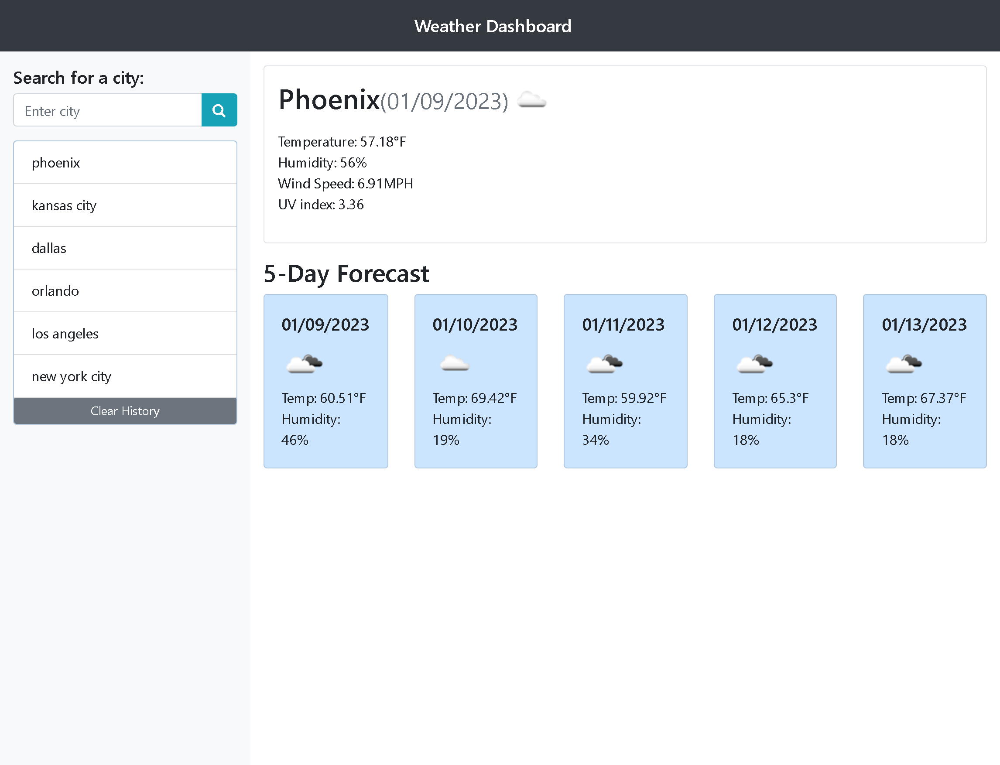

# Weather-Dashboard

## Description

[Link to Weather Dashboard](https://anthonyfrederick7.github.io/Weather-Dashboard/)

  - The Weather Dashboard was made for travelers to easily track a 5 day weather forcast for the searched city so they can plan accordingly.

## Installation

N/A

## Usage

  - The search bar allows the user to input a city and after entering it will display a 5 day forcast for that city.

  - If the user closes the page, the previously searched cities will still show in past searches.

  - The user can clear the previously searched cities via the Clear History button under the search bar.

## Credits

  - https://github.com/AnthonyFrederick7

## Reference Links

  - https://www.w3schools.com/
  - https://developer.mozilla.org/

## License

N/A
